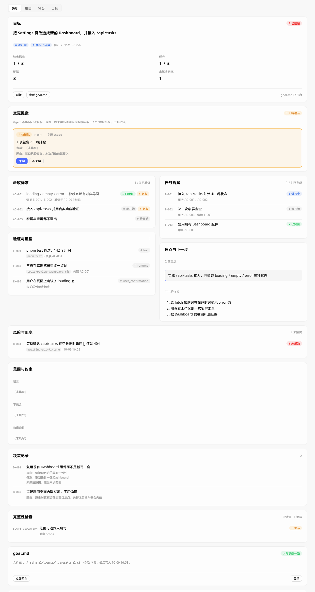

<div align="center">

# DSH-Luzzy

**给 DeepSeek Harness 的一组插件与配套工程**

一个与「对话」「轨迹」并列的第三个视图 · 一套可迁移的 Agent 预设 · 一份把踩坑写死的调研

[](#-迭代期声明)
[](#验证)
[](LICENSE)
[](#环境要求)

<sub>仓库名 <code>DSH-Luzzy</code> · 维护 <a href="https://github.com/LuzzyMeow">@LuzzyMeow</a></sub>

</div>

---

> [!WARNING]
> ## 🚧 迭代期声明
>
> **本项目处于持续迭代期，功能并不完善。**
>
> 下面是**如实**的状态，不是免责话术：
>
> - **API 与数据结构会变**，不保证向后兼容。计划带 `revision`，但没有迁移脚本 —— 升级后旧计划可能读不出来。
> - **DSH 自身是 developer preview**，官方声明 *"THERE WILL BE COMPATIBILITY-BREAKING CHANGES"*。本项目跟着它漂。
> - **只在单机、单用户、Windows + Edge 上实测过。** macOS / Linux、多人共用、非 Edge 浏览器**一概未验证**。
> - **「目标」子页的部分链路只在自己搭的装置里验过**，没有在你机器上跑过（见 [未验证的部分](#未验证的部分)）。
> - **AOCI 索引处于 `blocked`**（19 张截图待人工策展），索引条目与真实文件不完全同步。
> - **有若干已知边界是设计如此，不是待办** —— 它们写在 [已知边界](#已知边界) 里，免得你以为是漏做。
>
> **可以拿它做**：读设计、抄踩坑清单、在自己的 DSH 上试装。
> **先别拿它做**：生产依赖、多人协作的基础设施、无人值守的长任务。

---

## 目录

- [这是什么](#这是什么)
- [四个部分](#四个部分)
- [界面](#界面)
- [「目标」子页在设计上回答什么](#目标子页在设计上回答什么)
- [快速开始](#快速开始)
- [验证](#验证)
- [项目结构](#项目结构)
- [文档地图](#文档地图)
- [未验证的部分](#未验证的部分)
- [已知边界](#已知边界)
- [环境要求](#环境要求)
- [安全与隐私](#安全与隐私)
- [许可与第三方](#许可与第三方)
- [给接手的人](#给接手的人)

---

## 这是什么

[DeepSeek Harness](https://github.com/deepseek-ai/deepseek-harness)（`dsh`）的插件层没有特权内核 —— 模型适配器与 agent 主循环本身也是插件。这个仓库放的是围绕这条机制做出来的东西：一个真实可用的界面插件、一套预设、以及为写它们而做的调研与踩坑记录。

三条主线：

| | 一句话 |
|---|---|
| **LuzzyPage** | DSH Web GUI 里的第三个视图，含「说明 / 用量 / 预设 / 目标」四个子页 |
| **LuzzyMode 预设** | 可迁移的 agent 预设：人格提示词 + 工具名单 |
| **调研与踩坑** | `docs/` 下的机制调研，`AGENTS.md` §五 的 30 条已证伪做法 |

> 这里最有价值的部分可能不是代码，而是 `AGENTS.md` §五 —— **30 条全部由真实的崩溃、白屏、静默错数换来的**，不是推测。碰 DSH 客户端插件之前先读那一节，能省掉几十轮。

---

## 四个部分

<table>
<tr><td width="25%" valign="top">

### 📄 说明

渲染本插件的 README。左右占满。

</td><td width="25%" valign="top">

### 📊 用量

Token 活动阵列（一个自然月，每格一天）、按模型的**单调平滑**趋势图、饼图。三个窗口：日 / 周 / 月。

</td><td width="25%" valign="top">

### ✍️ 预设

提示词与智能体名单，单栏 **实时预览**（渲染面即可编辑面），三种显示模式 + 图标工具栏。

</td><td width="25%" valign="top">

### 🎯 目标

长任务的**交付控制面**：验收标准、任务、证据、焦点、下一步、阻塞、决策，以及一个**完成门**。

</td></tr>
</table>

---

## 界面

<div align="center">

**「目标」子页 · 浅色**



<sub>两张图不同主题、窄屏也不同 —— 若哈希相同就是没验到（这是这个项目的一条硬判据）</sub>

</div>

---

## 「目标」子页在设计上回答什么

它想解决的是长任务里的一个具体失败：**Agent 说「完成了」，而你不知道它凭什么这么说。**

于是把「完成」变成一件要**挣来**的事：

| 不变量 | 做法 |
|---|---|
| **完成必须挣来** | `update_goal(action=complete)` 会先过**完成门**：验收标准没验证完、关键阻塞没清掉，就拒绝，并说明还差什么 |
| **Agent 不能改写人类权威字段** | 目标、范围、约束、必需的验收标准 —— Agent 只能**提议**；人类操作走**另一个函数**，代码里没有一条路径能让 Agent 走到它 |
| **写入是 compare-and-set** | 每份计划带 `revision`，写入必须带读到的那个。过期的写入被拒，不覆盖 |

四条生命周期钩子挂在 DSH 自己的公开扩展点上（**不改 agent-loop**）：

```
USER
  │
  ▼  agent/pre-step      ── 方向注入：每个有 goal 的轮次注入一段 ~740 字节的紧凑状态
MODEL WORK
  │
  ▼  tools/pre-execute   ── 完成门：过早的 complete 被拒，且到不了 ctx.goals
  ▼  agent/turn-stopping ── 对账屏障：本轮真的改了工作区而计划没动 → steer 一次
  ▼  tools/post-execute  ── 结果增强：get_goal 带上交付摘要与指标
FINAL
```

**成本是有意的**：注入的是紧凑块，不是整份 `goal.md`。`goal.md` 是**投影**，不是第二个数据库 —— 运行时状态才是权威，文件只是它的渲染结果，而且**按会话选择开启**。

<details>
<summary><b>为什么不用「另一个 LLM 审查 Agent 是否完成」</b></summary>

<br>

确定性规则优先。`revision` 对不对、必需字段在不在、证据是否存在、必需的验收标准是否已验证 —— 这些 Runtime 判，不花一个 token。

只有真正需要语义判断的（*这是不是长期任务*、*某个阻塞是否仍然存在*）才交回模型。

这也意味着：**钩子不会给模型加审查轮次**。它只在对账真的必要时才开口。
</details>

---

## 快速开始

### 前置

- **DeepSeek Harness**（本仓库对着 `0.1.5-rc.1` / `rc.2` 验；见 [环境要求](#环境要求)）
- Node.js 20+（工具链用 Node 24 验过）

### 安装 LuzzyPage

路径含空格时 `dsh plugin add <路径>` 会被 PowerShell 拆成两个参数、装出两个垃圾依赖。所以走手工路线：

**1 · 克隆**

```bash
git clone git@github.com:LuzzyMeow/DSH-Luzzy.git
```

**2 · 在 profile 里加两处**

`~/.dsh/profiles/desktop/package.json`：

```jsonc
{
  "dependencies": { "dsh-luzzy-page": "file:../../<你的路径>/luzzy-page" },
  "dsh": { "profile": { "bundles": [ "...", "dsh-luzzy-page" ] } }
}
```

**3 · 建立链接**

```bash
dsh plugin --profile desktop install
```

**4 · 重启 DSH**

> ⚠️ **宿主半不热重载。** 改 `lib/client.js`（客户端半）立刻生效；改 `lib/index.js`（宿主半）**必须重启 DSH**。诊断时先分清是哪一半 —— 这条踩过一次，浪费了几十轮。

**5 · 确认挂上了**

```bash
dsh --profile desktop --dump-config | grep -A2 luzzy
```

### 跑一遍测试

```bash
cd luzzy-page

# 全部套件（test-*.mjs 加上两个同样算套件的脚本）
for f in tools/test-*.mjs tools/render-frame-preview.mjs tools/probe-goal-layout.mjs; do
  node "$f" || echo "FAILED: $f"
done

# 三道帧门禁（改过帧内任何一行都必须过）
node tools/scan-frame-backticks.mjs
node tools/check-frame-script.mjs
node tools/probe-goal-layout.mjs
```

**判据**：`lib/client.js` 的 mtime 必须**晚于** `src/client.js`。它俩是产物与源 —— 只改 `src/` 不重建，运行的是旧代码。

---

## 验证

这个项目对「验过了」的门槛定得比较高。当前状态：

| 项 | 结果 |
|---|---|
| 测试套件 | **25 个 / 1211 条断言 / 0 失败** |
| 帧门禁 | 反引号扫描 · 帧脚本编译（3219 行）· 目标页无横向溢出 |
| 真机证据 | 方向注入、完成门拒签、对账屏障 **都在真实 DSH 里发生过** |
| 可证伪性 | 每处关键修复都验过「把实现改回去 → 断言变红」 |
| 截图 | 三种变体**逐字节不同**（相同即未验到） |

几条**有意做得很粗**的断言，因为一次疏忽就会退回真实事故：

- 帧模板里出现任何 `alert(` / `confirm(` / `prompt(` → 失败
  <sub>原生对话框是 OS 级模态，关掉后**键盘焦点不会还给页面** —— 用户从此点不动输入框（§5.22）</sub>
- 客户端必须**在客户端侧**建会话，且 `create` 之后必须 `open`
  <sub>宿主侧建出来的会话**不可能显示**在侧栏里（§5.24）</sub>
- 测试替身必须是**会抛的代理**，与插件真实 `inject` 一致
  <sub>替身比真货宽松 = 假绿区（§5.21）</sub>

---

## 项目结构

```
DSH-Luzzy/
├── luzzy-page/            ← 主插件（dsh-luzzy-page）
│   ├── lib/               宿主半 + 客户端半
│   │   ├── index.js           宿主入口：注册路由、工具、四条钩子
│   │   ├── client.js          【产物】由 src/client.js 构建
│   │   ├── goal-domain.mjs    纯函数：交付域、完成门、完整性、漂移
│   │   ├── goal-enforce.mjs   四条生命周期钩子
│   │   └── usage-*.mjs        用量聚合、窗口、缓存、worker
│   ├── src/client.js      ← 客户端与帧文档的唯一手写源
│   ├── tools/             65 个：测试 / 探针 / 截图 / 构建
│   └── docs/shots/        离线验收截图
│
├── luzzy-preset/          ← 可迁移的 Agent 预设（人格 + 工具名单）
├── skills/                ← 从 LuzzyPrompt 拷贝的 4 个设计 skill
├── docs/                  ← 机制调研与工作节点记录
└── AGENTS.md              ← ★ §五 是 30 条已证伪做法，改代码前必读
```

**架构一句话**：插槽条目渲染一个 `<iframe srcDoc={自包含文档}>`，帧内是纯 HTML + 原生 JS。

<details>
<summary><b>为什么是 iframe —— 三条死路换来的</b></summary>

<br>

| 试过的做法 | 症状 | 根因 |
|---|---|---|
| 组件里 `require('react')` 调 hooks | **整页白屏**，无报错 | 宿主用自己的内联 React；第二实例 → Invalid hook call → 错误边界吃掉整页 |
| hooks-free 组件 + `defineStore` | **整页白屏** | `conversation.view` 的 props 里**没有** store |
| 依赖框架注入的 `t` | 白屏 | view 层的 render 调用不传 locale |

**唯一稳的做法：iframe。** 帧内零 React / 零 hooks / 零框架注入，数据走同源相对路径 `fetch('/__luzzy/...')`。
</details>

---

## 文档地图

| 文件 | 内容 |
|---|---|
| [`docs/README.md`](docs/README.md) | **从这里进** —— 导航与来源分级 |
| [`docs/05-前端技术栈…`](docs/05-前端技术栈与客户端插件机制.md) | 写客户端插件前必读：插槽两步注册、iframe 用法 |
| [`luzzy-page/docs/GOAL-交付层.md`](luzzy-page/docs/GOAL-交付层.md) | 「目标」子页的完整设计：三个不变量、钩子为什么长那样、错误码 |
| [`luzzy-page/README.md`](luzzy-page/README.md) | 插件门面（**会在「说明」子页里被运行时渲染**） |
| [`docs/STATUS-LuzzyPage工作节点.md`](docs/STATUS-LuzzyPage工作节点.md) | 进度、失败史、下一步 —— 上下文压缩后的接续点 |
| [`AGENTS.md`](AGENTS.md) | §五：30 条已证伪做法 |

---

## 未验证的部分

放在显眼处，因为**「代码对」和「跑过」是两件事**。

| 项 | 状态 |
|---|---|
| 在**你的** DSH 实例里点开「目标」子页 | ❌ 没有观测过。真机 `diag` 里只有重启前的一次失败尝试 |
| 上述链路本身 | ✅ **验过** —— 自己起真 HTTP server + 真浏览器 + 真鼠标点击，14/14 通过，且可证伪 |
| 非 Edge 浏览器 | ❌ 未测 |
| macOS / Linux | ❌ 未测 |
| 多人 / 多用户并发 | ❌ 未测（CAS 的逻辑验过，但没有真实并发用户） |
| 大仓库（>50 万行） | ❌ 未测 |

**「在自己搭的装置里跑通」≠「在你的机器上跑通」。** 前者我能自证，后者不能 —— 所以我把它列在这里，而不是含糊过去。

---

## 已知边界

**设计如此，不是待办**：

| 边界 | 为什么 |
|---|---|
| 桌面版对无凭据的浏览器请求一律 **403** | 安全边界。凭据是每次启动随机生成、不落盘的 token |
| **从进程外探测宿主路由拿不到有效信号** | 同上 —— 想验路由只能在渲染进程里验，或自己起 server |
| **`goal.md` 按会话选择开启** | 不往用户的工作区里默认写文件 |
| **AOCI 索引 `blocked`** | 19 张截图的策展裁决要**人**做；不批准也能用，只是索引与文件不完全同步 |
| **`docs/shots/` 不在索引里** | 同上，那条裁决的一部分 |

**尚未完成**：

| 项 | 说明 |
|---|---|
| 计划的**迁移脚本** | 升级后旧 `revision` 的计划可能读不出来 |
| **多会话并发**的真实测试 | 逻辑有 CAS，但没拿两个真实用户压过 |
| 「目标」子页的部分**交互细节** | 提案（Proposal）有数据模型，但没有审批 UI |

---

## 环境要求

| 项 | 版本 / 说明 |
|---|---|
| **DSH** | `0.1.5-rc.1`（Desktop 运行时）/ `0.1.5-rc.2`（官方包）。**跟着它漂** |
| **Node.js** | 20+（工具链用 24 验过，零运行时依赖） |
| **操作系统** | Windows（实测）。macOS / Linux 未验证 |
| **浏览器** | Edge（截图与自动化验收用它） |

> **版本耦合警告**：客户端半与宿主半的**协议是隐式的**。客户端热重载、宿主不重载 → 「新客户端 + 旧宿主」是**常态而非异常**。协议一变，旧宿主会给出「缺字段但不报错」的响应 —— 那会把**版本不一致伪装成「你没有数据」**，是最坏的一类错误。现在的做法是明确报「宿主半是更新前的版本，请重启 DSH」。

---

## 安全与隐私

- **无运行时依赖**：`luzzy-page` 的 host 半只用 Node 内置模块；图表与 Markdown 渲染器手写在帧内。
- **凭证零入库**：仓库内不含任何 API Key / token / cookie。`.gitignore` 覆盖 `.env*`、`*token*`、`*credential*`、`*cookies*`。
- **数据不出本机**：插件读的是本机会话日志（`~/.dsh/`），渲染在本地 iframe 里，**不发起任何外部网络请求**。
- **`reference/` 不入版本控制**：1.42 GB 的上游克隆，随时可重新克隆。
- **第三方内容已排除**：调研所用的一手素材（B 站视频字幕与公开评论笔记）含他人内容，**不随本仓库分发**（在 `.gitignore` 里）。

---

## 许可与第三方

**本仓库：MIT**（见 [LICENSE](LICENSE)）。

| 部分 | 许可 | 说明 |
|---|---|---|
| `luzzy-page` / `luzzy-preset` | MIT | 本项目 |
| `skills/luzzy-roster-*` | 见各自 `LICENSE` | 从 [LuzzyMeow/LuzzyPrompt](https://github.com/LuzzyMeow/LuzzyPrompt) 拷贝，SHA256 已核 |
| 字体 | Alibaba PuHuiTi / Alibaba Sans | 构建时按用到的字形做子集 |
| `reference/`（不入库） | lobe-ui / lobe-icons 是 **MIT**；lobehub 是 **NOASSERTION** | 自用参考没问题；**对外分发前须单独确认条款** |

> **`reference/` 里的上游代码是参考，不是引入。** 把任何上游代码拷进本项目前，先过许可。

---

## 给接手的人

1. **先读 [`AGENTS.md`](AGENTS.md) §五。** 30 条已证伪做法，每条都是真实崩溃换来的。
2. **再读 [`docs/STATUS-LuzzyPage工作节点.md`](docs/STATUS-LuzzyPage工作节点.md)。** 它含未完成项与诊断手段。
3. **没有控制台就别改代码。** 帧是独立文档，它抛的错**不进宿主控制台** —— 先装黑匣子（帧内 `report()` + 宿主 diag 写文件），再动手。
4. **改帧内任何一行，三道门都要过**（反引号 / 帧脚本编译 / 真实浏览器探针）。只跑构建不算过。
5. **改完客户端必须重建**：`python tools/build-font-css.py`。

<div align="center">
<br>
<sub>

**迭代期项目 —— 接口会变，功能不完善，欢迎 issue 但请容忍粗糙。**

做这个东西的过程本身写在了 `docs/` 里：包括那些走错的路。

</sub>
</div>
